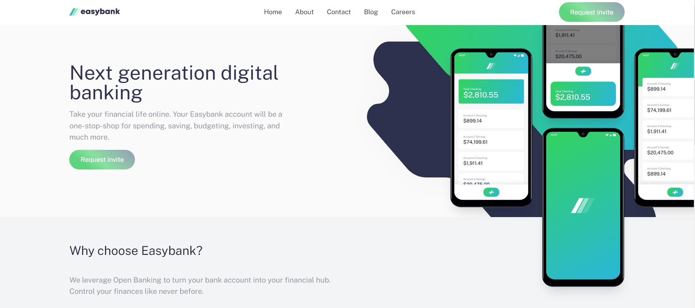
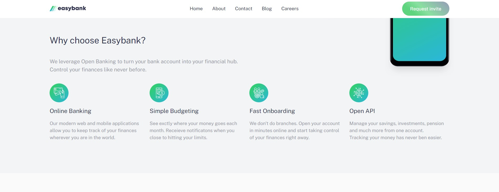
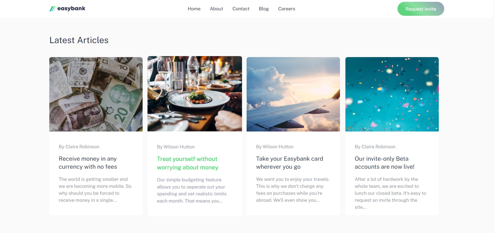
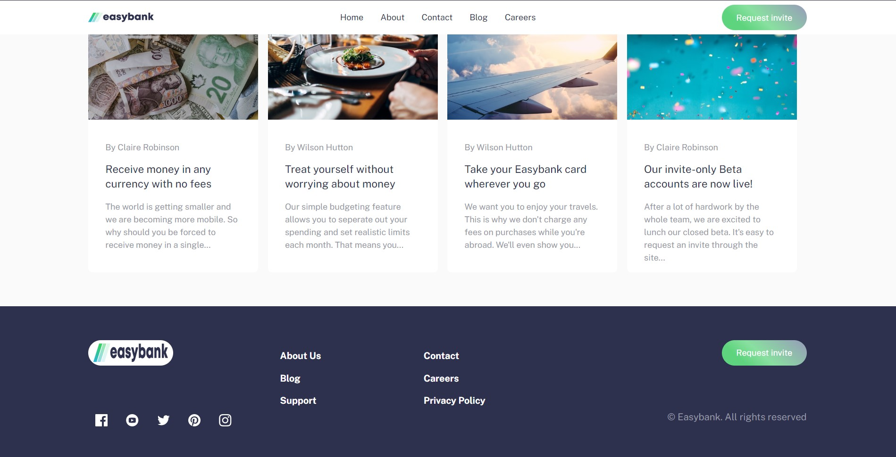

live link https://easybnk.netlify.app/

# Frontend Mentor - Easybank landing page solution

This is a solution to the [https://easybnk.netlify.app/]

## Table of contents

- [Overview](#overview)
  - [The challenge](#the-challenge)
  - [Screenshot](#screenshot)
  - [Links](#links)
- [My process](#my-process)
  - [Built with](#built-with)
  - [What I learned](#what-i-learned)
  - [Continued development](#continued-development)
  - [Useful resources](#useful-resources)
- [Author](#author)
- [Acknowledgments](#acknowledgments)

## Overview

### The challenge

Users should be able to:

- View the optimal layout for the site depending on their device's screen size
- See hover states for all interactive elements on the page

### Screenshot

### Links

- Solution URL: [https://easybnk.netlify.app/]

## My process

### Built with

- Semantic HTML5 markup
- CSS custom properties
- Flexbox
- CSS Grid
- Mobile-first workflow
- [React](https://reactjs.org/) - JS library
- [Tailwind Css](https://tailwindcss.com/) - For styles

## Author

- Website - [Ugorji Victor](https://blcktitan.github.io/Eze-Portfolio/)
- Frontend Mentor - [@BlckTitan](https://www.frontendmentor.io/profile/BlckTitan)
